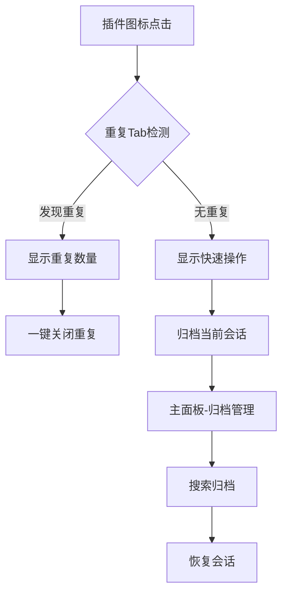

## 1. 产品概述

Duplicate Tabs Killer是一款Chrome浏览器插件，用于智能管理浏览器标签页。该插件能够自动检测并关闭重复的Tab页，同时提供标签页分类和归档功能，帮助用户保持浏览器整洁有序，提升工作效率。

目标用户：经常需要同时打开多个标签页进行工作的专业人士、研究人员、学生等。

## 2. 核心功能

### 2.1 用户角色

| 角色   | 注册方式       | 核心权限               |
| ---- | ---------- | ------------------ |
| 普通用户 | Chrome商店安装 | 使用所有Tab管理功能，数据本地存储 |

### 2.2 功能模块

插件包含以下核心功能模块：

1. **重复Tab检测**：自动扫描所有打开的Tab页，识别URL完全相同的重复页面
2. **一键关闭重复**：智能保留一个Tab，关闭其他所有重复项
3. **Tab分类管理**：按域名自动分组，支持手动创建自定义分组
4. **归档与恢复**：将当前Tab会话保存为归档，随时恢复之前的工作状态
5. **搜索与筛选**：快速搜索已归档的Tab，支持按时间、域名等条件筛选

### 2.3 页面详情

| 页面名称 | 模块名称    | 功能描述                       |
| ---- | ------- | -------------------------- |
| 弹出窗口 | 重复Tab检测 | 显示检测到的重复Tab数量，提供一键关闭按钮     |
| 弹出窗口 | 快速操作区   | 显示当前打开的Tab总数，提供归档当前会话的快速入口 |
| 主面板  | Tab列表   | 显示所有打开的Tab，支持按域名分组显示       |
| 主面板  | 归档管理    | 显示所有保存的归档会话，支持搜索、删除、恢复操作   |
| 主面板  | 设置面板    | 配置白名单域名、自动检测频率、归档保留时长等     |
| 归档详情 | 会话信息    | 显示归档时的Tab列表、创建时间、域名统计      |
| 归档详情 | 恢复选项    | 选择性恢复部分Tab或全部恢复            |

## 3. 核心流程

### 用户使用流程

1. **重复Tab清理流程**：

   * 用户点击插件图标 → 查看重复Tab检测结果 → 点击"关闭重复"按钮 → 确认操作 → 系统自动保留一个Tab，关闭其他重复项

2. **Tab归档流程**：

   * 用户打开主面板 → 点击"归档当前会话" → 输入会话名称 → 选择归档范围（全部/当前窗口/选中的Tab）→ 确认保存

3. **归档恢复流程**：

   * 用户进入归档管理 → 浏览或搜索目标归档 → 点击查看详情 → 选择恢复方式（全部/选择性恢复）→ 确认恢复

## 4. 用户界面设计

### 4.1 设计风格

* **主色调**：Chrome蓝色系（#1a73e8）配合白色背景

* **按钮样式**：圆角矩形，扁平化设计，主要操作为实心按钮

* **字体**：系统默认字体，14-16px为主，标题18-20px

* **布局风格**：卡片式布局，清晰的视觉层次

* **图标风格**：使用Material Design图标，简洁明了

### 4.2 页面设计概览

| 页面名称 | 模块名称    | UI元素                                          |
| ---- | ------- | --------------------------------------------- |
| 弹出窗口 | 重复Tab检测 | 顶部显示检测状态图标，中央显示重复数量，底部提供一键关闭按钮，使用警告色（橙色）突出显示  |
| 弹出窗口 | 快速操作区   | 显示当前Tab统计信息，提供归档按钮和进入主面板的入口，使用图标+文字的组合按钮      |
| 主面板  | Tab列表   | 左侧树形结构显示域名分组，右侧列表显示具体Tab，支持拖拽排序，使用标签页切换不同视图   |
| 主面板  | 归档管理    | 网格布局显示归档卡片，每张卡片显示会话名称、Tab数量、创建时间，顶部提供搜索框和筛选选项 |
| 设置面板 | 白名单配置   | 输入框添加域名，列表显示已添加的白名单，支持删除操作，提供导入/导出功能          |

### 4.3 响应式设计

* **桌面端优先**：主要针对桌面版Chrome浏览器优化

* **弹出窗口尺寸**：默认400×600px，支持最小300×400px

* **主面板尺寸**：独立窗口，默认800×600px，支持最大化

* **触控优化**：按钮尺寸不小于44px，适合触控操作

### 4.4 交互细节

* **实时检测**：Tab状态变化时自动更新显示

* **操作反馈**：所有操作都有即时的视觉反馈（加载动画、成功提示）

* **键盘快捷键**：支持Ctrl+Shift+D快速打开归档管理

* **右键菜单**：在Tab右键菜单中添加"归档此Tab"选项

