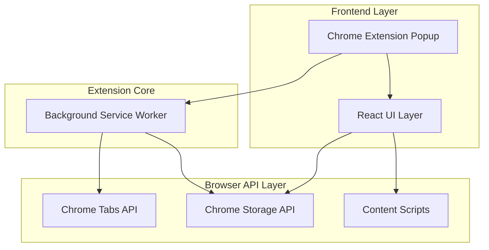
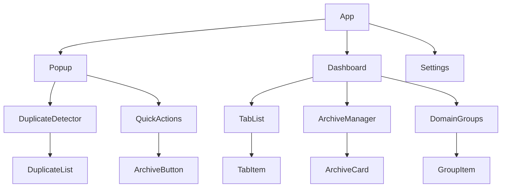

## 1. 架构设计



## 2. 技术描述

* **前端框架**：React\@18 + TypeScript

* **样式框架**：TailwindCSS\@3

* **构建工具**：Vite + Chrome Extension Manifest V3

* **存储方案**：Chrome Storage API（chrome.storage.local）

* **UI组件库**：Headless UI + 自定义组件

* **状态管理**：React Context + useReducer

* **开发工具**：Chrome DevTools + React Developer Tools

## 3. 路由定义

| 路由           | 用途                    |
| ------------ | --------------------- |
| /popup       | 插件弹出窗口，显示快速操作和重复Tab检测 |
| /dashboard   | 主面板，完整的Tab管理和归档功能     |
| /settings    | 设置页面，白名单配置和插件选项       |
| /archive/:id | 归档详情页面，显示特定归档会话的Tab列表 |

## 4. Chrome Extension API定义

### 4.1 核心API接口

**Tab管理相关**

```typescript
// 获取所有Tab信息
chrome.tabs.query({})

// 关闭指定Tab
chrome.tabs.remove(tabIds: number[])

// 创建新Tab
chrome.tabs.create({ url: string })

// 更新Tab属性
chrome.tabs.update(tabId: number, { url: string })
```

**存储相关**

```typescript
// 保存归档数据
chrome.storage.local.set({ archives: Archive[] })

// 获取归档数据
chrome.storage.local.get(['archives'])

// 保存设置
chrome.storage.sync.set({ settings: PluginSettings })
```

### 4.2 数据类型定义

```typescript
interface TabInfo {
  id: number;
  url: string;
  title: string;
  favIconUrl?: string;
  domain: string;
  groupId?: string;
}

interface Archive {
  id: string;
  name: string;
  tabs: TabInfo[];
  createdAt: number;
  domainCount: Record<string, number>;
}

interface PluginSettings {
  whitelist: string[];
  autoDetectInterval: number;
  archiveRetentionDays: number;
  showNotifications: boolean;
}

interface DuplicateGroup {
  url: string;
  tabs: chrome.tabs.Tab[];
  keepTabId: number;
}
```

## 5. 组件架构



## 6. 存储架构

### 6.1 数据模型

**本地存储结构**

```typescript
interface StorageData {
  archives: {
    [archiveId: string]: Archive;
  };
  settings: PluginSettings;
  statistics: {
    totalTabsClosed: number;
    totalArchivesCreated: number;
    lastCleanup: number;
  };
}
```

### 6.2 存储策略

* **chrome.storage.local**：存储归档数据、统计数据（本地持久化）

* **chrome.storage.sync**：存储设置配置（跨设备同步）

* **IndexedDB**：大数据量归档的备选存储方案

* **内存缓存**：运行时Tab状态信息，提高响应速度

## 7. 权限配置

**Manifest V3权限声明**

```json
{
  "permissions": [
    "tabs",
    "storage",
    "activeTab",
    "contextMenus"
  ],
  "host_permissions": [
    "http://*/*",
    "https://*/*"
  ]
}
```

## 8. 性能优化

### 8.1 性能策略

* **防抖处理**：Tab变化事件防抖，避免频繁检测

* **虚拟滚动**：大量Tab列表使用虚拟滚动优化

* **懒加载**：归档详情页面按需加载Tab信息

* **缓存机制**：重复Tab检测结果缓存，减少API调用

### 8.2 内存管理

* **Service Worker生命周期**：合理管理后台脚本生命周期

* **事件监听器**：及时清理无用的事件监听器

* **大对象处理**：归档数据分页加载，避免内存溢出

## 9. 错误处理

### 9.1 错误类型

* **API错误**：Chrome API调用失败处理

* **存储错误**：本地存储空间不足处理

* **权限错误**：用户拒绝权限时的降级方案

### 9.2 错误恢复

* **自动重试**：关键操作失败后的自动重试机制

* **数据备份**：重要数据的定期备份和恢复

* **用户通知**：友好的错误提示和解决方案建议

