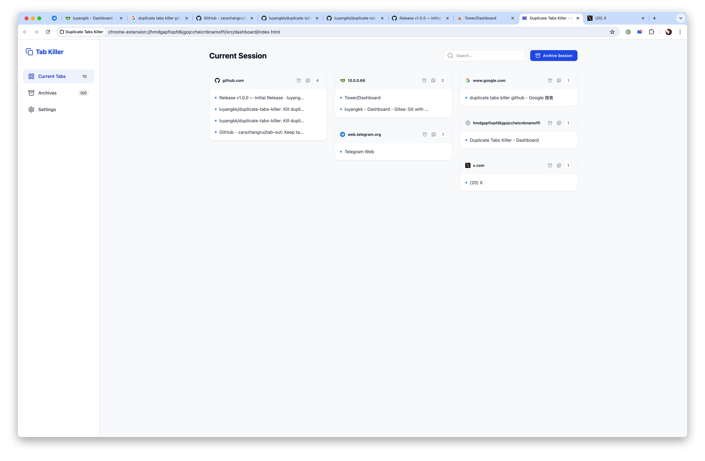
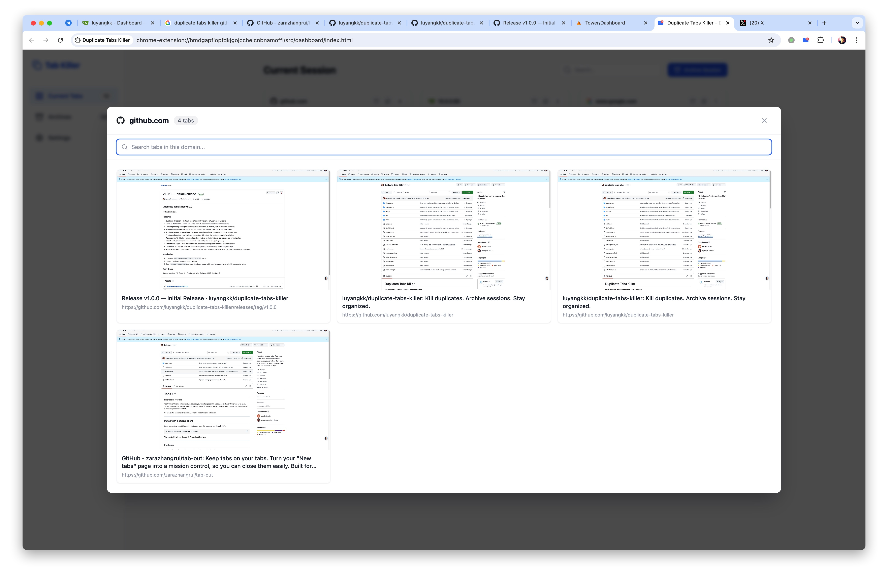
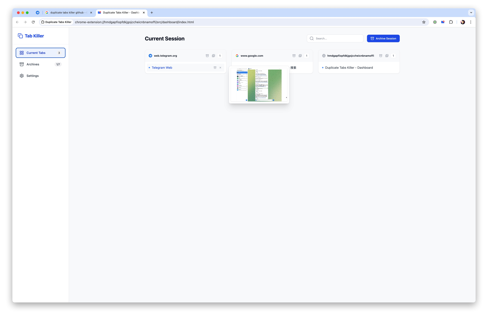
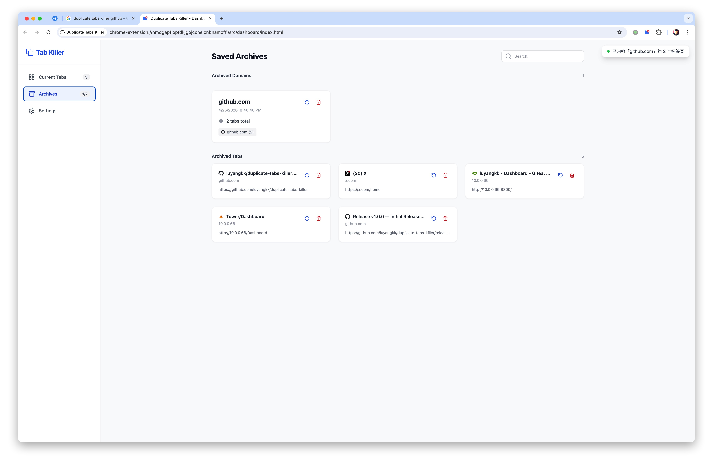

# Duplicate Tabs Killer

**Kill duplicates. Archive sessions. Stay organized.**

Duplicate Tabs Killer is a Chrome extension that detects and closes duplicate tabs, groups all open tabs by domain, captures screenshot previews, and lets you archive entire sessions for later — all without leaving the browser.

No server. No account. No external API calls. Just a Chrome extension.

---

## Features

- **Duplicate detection** — instantly spots tabs with the same URL across all windows, with one-click cleanup
- **Close all duplicates at once** — keeps the active (or first) copy and closes the rest
- **Domain grouping** — all open tabs organized into cards by domain, with favicon and tab count
- **Screenshot previews** — hover over a tab to see a live preview captured in the background
- **Archive a session** — save all open tabs as a named snapshot and restore the whole session later
- **Archive a single tab** — right-click any page to archive it via context menu before closing
- **Restore with full fidelity** — archived sessions restore original windows, tab groups, and pinned states
- **Search** — filter current tabs and archived sessions by title or URL (Cmd/Ctrl+F)
- **Popup quick-view** — click the toolbar icon for a compact duplicate summary and one-click fix
- **Dashboard** — full-page interface for tab management, archive history, and storage settings
- **Auto cache cleanup** — screenshot previews expire automatically on a daily schedule; clear manually from Settings

---

## Screenshots









---

## Installation

**1. Download the latest release**

Download the `.zip` file from the [Releases](../../releases) page.

**2. Extract the zip**

Unzip it anywhere on your machine. You'll get a folder with the extension files inside.

**3. Load into Chrome**

1. Open `chrome://extensions`
2. Enable **Developer mode** (top-right toggle)
3. Click **Load unpacked**
4. Select the extracted folder

That's it — the extension icon appears in your toolbar.

---

## Development

```bash
npm run dev      # start dev server with HMR (hot reload via CRXJS)
npm run check    # TypeScript type-check only
npm run lint     # run ESLint
npm run test     # run Vitest
npm run zip      # build and package a versioned .zip for distribution
```

---

## How it works

```
You click the toolbar icon
  -> Popup shows duplicate count and a list of duplicate groups
  -> Hit "Close All Duplicates" to clean up in one shot

You open the Dashboard
  -> All tabs grouped by domain with screenshot hover previews
  -> Search to find any tab by title or URL
  -> Archive a domain or the whole session — named snapshots, stored locally
  -> Restore any archive to recreate the exact tab layout

You right-click any page
  -> "Archive current tab" saves it and closes it

Background service worker
  -> Captures JPEG screenshots when tabs load or become active
  -> Tracks tab URLs to clean up previews when tabs close
  -> Runs a daily alarm to expire stale preview cache
```

---

## Tech stack

| What | How |
|------|-----|
| Extension | Chrome Manifest V3 |
| Framework | React 18 + TypeScript |
| Build | Vite + CRXJS Vite Plugin (HMR support) |
| Styling | Tailwind CSS 3 |
| State | Zustand 5 |
| Routing | React Router v7 |
| Storage | chrome.storage.local |
| Screenshots | chrome.tabs.captureVisibleTab (JPEG, 50% quality) |

---

## License

For learning and personal use only.
